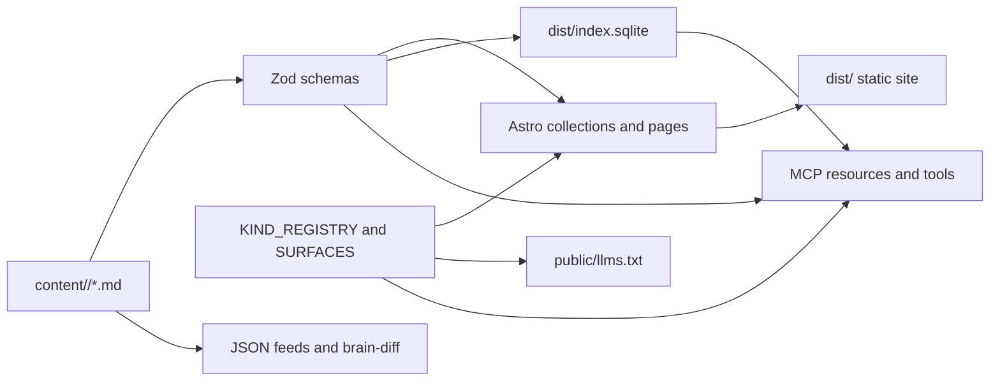

# thinkinglabs

`thinkinglabs` is a personal thinking surface with an agent-readable operating layer. The source of truth is the git tree: every durable object lives as a Markdown file with Zod-validated frontmatter under `content/`. The website, JSON APIs, feeds, `llms.txt`, SQLite index, and MCP server are all projections of that source.

The important rule is simple: edit source files, then rebuild derived artifacts. Do not treat `dist/index.sqlite`, public feeds, MCP responses, or the rendered Astro site as canonical state.

## What lives here

- `content/` - canonical public objects: thoughts, claims, projects, predictions, decisions, questions, posts, inputs, changed-my-mind entries, and AI provenance events.
- `src/schemas/` - per-kind Zod schemas and `KIND_SCHEMAS`, the shared schema registry.
- `src/lib/registry.ts` - public metadata for each kind: routes, title/date fields, API exposure, MCP views, and feed participation.
- `src/pages/` - Astro pages and one JSON endpoint per public kind.
- `src/frontend/thinkinglabs-ui/` - Astro UI compositions, components, styles, and Storybook mock data.
- `scripts/` - artifact builders, curation CLIs, background-agent entrypoints, and review tools.
- `servers/thinkinglabs-mcp/` - local stdio MCP server.
- `servers/thinkinglabs-mcp-http/` - Streamable HTTP MCP transport over the same server factory.
- `.harness/` - canonical agent-facing configuration for prompts, MCP settings, hooks, skills, and provider outputs. Edit `.harness/src/**`, then run `pnpm harness apply`.

## Quickstart

Prerequisites:

- Node `>=22.19.0`
- pnpm `10.33.2` as declared in `package.json`
- Vite+ `vp`, used for install, lint, formatting, checks, and tests

```sh
vp install
pnpm dev
```

Useful commands:

```sh
pnpm dev                 # Astro dev server
pnpm build               # astro check + astro build + dist/index.sqlite
pnpm preview             # astro preview (local QA / Playwright only; not a prod server)
pnpm storybook           # Storybook v10 UI review
pnpm storybook:build     # static Storybook build

pnpm artifacts           # offline brain-diff + site + feeds + llms.txt + index
pnpm artifacts:scored    # same, but requires the active LLM provider key
pnpm build:index         # rebuild only dist/index.sqlite

pnpm check               # vp check
pnpm lint                # vp lint
pnpm format              # vp fmt
pnpm test                # vp test run
pnpm verify              # clean, typecheck, check, build, structured-data, tests
pnpm verify:full         # verify + Playwright e2e

pnpm mcp:thinkinglabs       # local stdio MCP server
pnpm mcp:thinkinglabs:http  # Streamable HTTP MCP server, default 127.0.0.1:8787/mcp
```

`pnpm verify` is the normal local gate before publishing code changes. For content-only edits, `pnpm artifacts` is usually the useful rebuild because it refreshes the derived public artifacts as well as the site.

## Source model

Each content kind has three contracts that should move together:

1. A schema in `src/schemas/<kind>.ts`
2. A `KIND_SCHEMAS` entry in `src/schemas/index.ts`
3. A `KIND_REGISTRY` entry in `src/lib/registry.ts`

Public collections also need an Astro collection in `src/content.config.ts`, listing/detail pages under `src/pages/`, and an `/api/<kind>.json.ts` endpoint. Tests assert that the major registries cover the supported kinds, so drift should fail loudly.

The current public kinds are:

- `thoughts` - rougher prose and working ideas
- `claims` - atomic assertions with confidence, evidence, and review metadata
- `projects` - active, dormant, and archived work
- `predictions` - falsifiable forecasts with calibration views
- `changed-my-mind` - belief revisions
- `decisions` - ADR-style decisions and reversals
- `questions` - open questions and later answer triage
- `posts` - longer evergreen writing with per-section freshness
- `inputs` - external material that shaped thinking

`provenance` is source-backed and schema-validated, but it is not a normal public listing.

## Architecture in one pass



The Astro site renders from content collections, not from SQLite. The SQLite index is for agents and query surfaces. The MCP store prefers `dist/index.sqlite` when it exists and falls back to validated Markdown when it does not.

Architectural rationale lives in `docs/architecture/`. Read the relevant ADR before changing a pipeline; the docs explain the shape of the system, not just the mechanics.

## Agent and curation workflows

There are two human-in-the-loop curation paths:

- `pnpm derive-claims` proposes structured claims from rough thoughts.
- Background agents enqueue typed proposals into `.proposal-queue.json`; `pnpm review-proposals` is the interactive drain that accepts, edits, or rejects them.

The registered background agents are:

- `pnpm dormant-flip`
- `pnpm review-decisions`
- `pnpm resolve-predictions`
- `pnpm freshness-review`
- `pnpm triage-questions`

These CLIs are safe to rerun. They emit deterministic proposal IDs, so unchanged scans dedupe naturally. They do not write directly to `content/`; accepted mutations go through `review-proposals` and the relevant handler.

LLM-mediated code goes through `src/lib/llm.ts`. By default it expects `OPENAI_API_KEY`; set `LLM_PROVIDER=ollama` and `OLLAMA_API_KEY` to use Ollama instead. Offline paths, including `pnpm artifacts`, do not require a provider key. Scored paths, including `pnpm artifacts:scored`, fail fast if the active provider key is missing.

## Public and machine surfaces

The human site exposes listings, details, `/now`, `/about`, `/agents`, prediction calibration, contact, and health routes. Machine-readable surfaces are generated from the same registries:

- `/llms.txt` - inventory of public pages, listings, detail patterns, APIs, data files, and feeds
- `/<page>.md` - contract-validated Markdown variants for canonical public page and content routes; use `/index.md` for `/`
- `/api/<kind>.json` - flat JSON for each public kind
- `/feed/*.json` - deterministic JSON Feed outputs for revisions and resolutions
- `/feed/brain-diff.*` - local artifact feeds for substantive content changes
- `thinkinglabs://...` - MCP resources for public views, detail objects, schema version, model refs, and prediction calibration

The `.md` variants are derived page representations, not a second source model. Detail pages preserve the canonical markdown body after a small validated YAML envelope; listing pages come from the public kind registry; static pages are intentionally compact maintained summaries. The source schemas in `src/schemas/` remain the authority for content, while the Markdown route contracts only lock down the public envelope shape.

The MCP server exposes the same resources through two transports:

```sh
pnpm mcp:thinkinglabs -- --repo-root /path/to/thinkinglabs
pnpm mcp:thinkinglabs:http -- --repo-root /path/to/thinkinglabs
```

The HTTP transport is stateless, uses raw `node:http`, enforces a 1 MiB body cap, includes DNS-rebinding/CORS controls, and exposes `GET /healthz` for load balancer probes. See `docs/agents/mcp-server.md` and `docs/agents/mcp-http-server.md` for the full resource and tool tables.

## Frontend and Storybook

The production pages compose reusable Astro UI from `src/frontend/thinkinglabs-ui/`. Storybook stories live in `.storybook/stories/` and render the same UI-layer pieces used by the site.

- `src/frontend/thinkinglabs-ui/mocks/` keeps handoff-derived mock data separate from presentation.
- `src/frontend/thinkinglabs-ui/components/` holds reusable primitives, including headers, confidence meters, status tags, and charts.
- `src/frontend/thinkinglabs-ui/pages/` holds full-page compositions used by stories and routes.
- `src/frontend/thinkinglabs-ui/storybook/` holds Storybook-only Astro fixtures that need scoped component CSS.

Use Storybook when working on page composition, responsive typography, data display components, or route-level UI states:

```sh
pnpm storybook
pnpm storybook:build
```

See `docs/agents/storybook.md` for setup details and Astro support caveats.

Playwright coverage lives in `tests/e2e/` and runs through `pnpm test:e2e` or `pnpm verify:full`.

## Working conventions

- Keep durable knowledge in `content/`; rebuild everything else.
- Keep schemas, registry metadata, pages, APIs, and MCP exposure in sync when adding or changing a kind.
- Use shared primitives for proposal review, editor handoff, frontmatter patching, content loading, LLM calls, and JSON state. Do not fork those patterns in new agents.
- Use Vite+ commands through `vp` or package scripts that call `vp`.
- For agent-facing configuration, edit `.harness/src/**` and run `pnpm harness apply`; generated provider outputs are not the source of truth.

## Deployment

The site is deployed as a DigitalOcean App Platform **Static Site** component. DO runs `pnpm build`, uploads `dist/`, and serves it from their global CDN with HTTPS - no Node runtime in production. The app spec lives in `.do/app.yaml`. `astro preview` is dev/Playwright-only, not a production server.

Cache headers are fixed by DO (24h edge, 10s browser, purged on deploy) and cannot be customized per path. If finer cache control is ever needed, layer Cloudflare in front of the origin and use Page Rules there.

## Deeper docs

- `docs/architecture/ADR-001-source-vs-index.md` - source tree vs derived index
- `docs/architecture/ADR-002-markdown-frontmatter.md` - schema-driven content model
- `docs/architecture/ADR-007-thoughts-claims-derivation.md` - thoughts to claims pipeline
- `docs/architecture/ADR-009-proposal-confirmation-pattern.md` - unattended agents and human review
- `docs/architecture/ADR-010-personal-mcp-server.md` - MCP server rationale
- `docs/architecture/ADR-013-remote-mcp-http.md` - remote HTTP transport
- `docs/agents/proposal-pipeline.md` - adding or changing proposal agents
- `docs/agents/brain-diff-pipeline.md` - deterministic and scored feed generation
- `docs/agents/mcp-server.md` - local MCP server
- `docs/agents/mcp-http-server.md` - remote MCP server
- `docs/conventions/components.md` - UI component conventions
