# me

Personal agentic space — a public operating surface for my work. The git repo is canonical: every object (thought, claim, project, prediction, decision, question, post, input) lives as one markdown file with Zod-validated frontmatter under `content/`. The Astro site, the derived `dist/index.sqlite` query layer, and the personal MCP server are pure projections of that source tree.

## Quickstart

```sh
pnpm install
pnpm dev               # Astro dev server for the site
pnpm build             # static build + dist/index.sqlite
pnpm storybook         # Storybook v10 dev server for UI review with mocks
pnpm storybook:build   # Storybook static build
pnpm artifacts         # offline artifact build: brain-diff feeds, site, llms.txt, JSON feeds, dist/index.sqlite
pnpm artifacts:scored  # same artifact build, but require LLM-scored brain-diff output
pnpm verify            # local verification: typecheck, checks, build, metadata, index, tests
pnpm setup:e2e         # install Chromium for local Playwright runs
pnpm test:e2e          # build, then run Playwright against the preview
pnpm verify:full       # verify + e2e in one shot
pnpm build:index       # rebuild dist/index.sqlite (the agent-facing query layer)
pnpm mcp:thinkinglabs       # run the personal MCP server over stdio
pnpm mcp:thinkinglabs:http   # run the same server over Streamable HTTP (remote, default :8787)
```

`pnpm verify` runs the local validation path: typecheck, `vp check`, site build, structured-data check, index generation, and tests. Day-to-day, use `pnpm dev` while writing and `pnpm artifacts` after content edits to regenerate every local derived artifact. Use `pnpm artifacts:scored` when `OPENAI_API_KEY` (or `OLLAMA_API_KEY` with `LLM_PROVIDER=ollama`) is set and you want publish-quality brain-diff summaries.

## Storybook UI review surfaces

Storybook stories for UI-layer review live under `.storybook/stories/`. The UI they render lives under `src/frontend/thinkinglabs-ui/`.

- `mocks/` keeps handoff-derived mock data separate from presentation.
- `components/` holds reusable primitives (header, confidence meter, status tags, charts).
- `pages/` holds full-page compositions used in `stories/`.
- `storybook/` holds Storybook-only Astro fixtures that need scoped component CSS.

Run `pnpm storybook` for interactive review and `pnpm storybook:build` to verify static composition output.
See [`docs/agents/storybook.md`](./docs/agents/storybook.md) for setup details and Astro support caveats.

## Architecture and workflow

```mermaid
flowchart TB
  Human["Human author / local agent"]

  subgraph Authoring["Authoring and curation"]
    Editor["Markdown editor"]
    DeriveClaims["pnpm derive-claims<br/>thoughts to structured claims"]
    AgentScans["Background agent CLIs<br/>dormant-flip, review-decisions,<br/>resolve-predictions, freshness-review,<br/>triage-questions"]
    ReviewQueue["pnpm review-proposals<br/>human accepts, edits, rejects"]
  end

  subgraph Source["Canonical local state"]
    Content["content/{kind}/*.md<br/>YAML frontmatter + Markdown body"]
    Provenance["content/provenance/*.md<br/>accepted AI-assisted effects"]
    ContactJson["public/contact.json"]
    ProposalQueue[".proposal-queue.json<br/>gitignored proposal queue"]
    RejectionMemory[".*-rejections.json<br/>gitignored rejection memory"]
    Submissions["submissions/questions/*<br/>gitignored MCP intake inbox"]
  end

  subgraph Contracts["Shared contracts"]
    Schemas["src/schemas/*<br/>KIND_SCHEMAS"]
    Collections["src/content.config.ts<br/>Astro collections"]
    Registry["src/lib/registry.ts<br/>kind metadata"]
    Surfaces["src/lib/surfaces.ts<br/>public surface inventory"]
    LlmChokePoint["src/lib/llm.ts<br/>provider, model tier, key guard"]
  end

  subgraph BuildArtifacts["Local artifact builders"]
    LlmsTxt["scripts/build-llms-txt.ts<br/>public/llms.txt"]
    JsonFeeds["scripts/build-feeds.ts<br/>JSON Feed 1.1 files"]
    BrainDiff["scripts/brain-diff.ts<br/>git history + optional LLM scoring"]
    IndexBuild["scripts/build-index.ts<br/>dist/index.sqlite"]
    AstroBuild["astro build<br/>static site + API routes"]
  end

  subgraph Commands["Command workflows"]
    Dev["pnpm dev<br/>interactive site work"]
    Artifacts["pnpm artifacts<br/>offline local artifacts"]
    ArtifactsScored["pnpm artifacts:scored<br/>publish-quality brain-diff"]
    Verify["pnpm verify<br/>build + checks + tests"]
    E2E["pnpm test:e2e<br/>build + Playwright"]
    McpCommand["pnpm mcp:thinkinglabs<br/>stdio MCP server"]
    McpHttpCommand["pnpm mcp:thinkinglabs:http<br/>remote Streamable HTTP MCP server"]
  end

  subgraph Outputs["Generated outputs"]
    PublicSite["dist/<br/>static website"]
    PublicFeeds["public/feed/*.json<br/>deterministic JSON feeds"]
    BrainFeeds["public/feed/brain-diff*<br/>timestamped local artifacts, gitignored"]
    LlmsOutput["public/llms.txt<br/>agent-readable surface map"]
    Sqlite["dist/index.sqlite<br/>agent query layer, gitignored"]
  end

  subgraph RuntimeSurfaces["Read and interaction surfaces"]
    WebPages["src/pages/*<br/>listings, details, JSON APIs, embeds"]
    McpServer["servers/thinkinglabs-mcp<br/>stdio resources + tools"]
    McpHttp["servers/thinkinglabs-mcp-http<br/>Streamable HTTP transport<br/>(stateless, rate-limited)"]
    PublicUsers["Readers, crawlers, agents"]
  end

  Human --> Editor
  Human --> DeriveClaims
  Human --> ReviewQueue
  Editor --> Content
  DeriveClaims --> Content
  DeriveClaims --> Provenance
  AgentScans --> ProposalQueue
  AgentScans --> RejectionMemory
  ReviewQueue --> ProposalQueue
  ReviewQueue --> Content
  McpServer --> Submissions

  Content --> Schemas
  Schemas --> Collections
  Registry --> Surfaces
  Surfaces --> LlmsTxt
  Collections --> AstroBuild
  Content --> JsonFeeds
  Content --> IndexBuild
  Content --> BrainDiff
  Content --> McpServer
  ContactJson --> AstroBuild
  LlmChokePoint -. scored mode .-> BrainDiff
  LlmChokePoint -. AI curation .-> DeriveClaims
  LlmChokePoint -. AI proposals .-> AgentScans

  Dev --> WebPages
  Artifacts --> BrainDiff
  Artifacts --> AstroBuild
  Artifacts --> IndexBuild
  ArtifactsScored --> LlmChokePoint
  ArtifactsScored --> BrainDiff
  ArtifactsScored --> AstroBuild
  ArtifactsScored --> IndexBuild
  Verify --> AstroBuild
  Verify --> JsonFeeds
  Verify --> IndexBuild
  E2E --> AstroBuild
  McpCommand --> McpServer
  McpHttpCommand --> McpHttp
  Content --> McpHttp
  Sqlite --> McpHttp
  McpHttp --> PublicUsers

  BrainDiff --> BrainFeeds
  JsonFeeds --> PublicFeeds
  LlmsTxt --> LlmsOutput
  AstroBuild --> PublicSite
  IndexBuild --> Sqlite

  PublicFeeds --> AstroBuild
  BrainFeeds --> AstroBuild
  LlmsOutput --> AstroBuild
  WebPages --> PublicSite
  PublicSite --> PublicUsers
  Sqlite --> McpServer
  McpServer --> PublicUsers
```



The direction is intentional: source files under `content/` are the only durable knowledge state; builds, feeds, indexes, MCP responses, and the website are projections. Proposal agents can enqueue local suggestions, but accepted mutations still flow back through the human review step before touching content.

## What ships today

- **The Astro site** under `src/pages/` (rendered from `getCollection(kind)` plus the surface inventory in `src/lib/surfaces.ts`).
- **A personal MCP server** at `servers/thinkinglabs-mcp/` exposing fixed JSON resources and tools, with two transports against a shared factory:
  - **Stdio** (`pnpm mcp:thinkinglabs`) for local clients pointed at this checkout — see [`docs/agents/mcp-server.md`](./docs/agents/mcp-server.md).
  - **Streamable HTTP** (`pnpm mcp:thinkinglabs:http`, deployed at `https://mcp.thinkinglabs.run/mcp`) for remote agents that should not need to clone — stateless, raw `node:http`, with DNS-rebinding protection, CORS, a per-IP token-bucket rate limiter, and a `GET /healthz` probe. See [`docs/agents/mcp-http-server.md`](./docs/agents/mcp-http-server.md).
    Resource taxonomy, tool list, and the `dist/index.sqlite` fallback path are shared between both.
- **Five background agents** (`dormant-flip`, `review-decisions`, `resolve-predictions`, `freshness-review`, `triage-questions`) that scan content and enqueue typed proposals; the human drains the queue with `pnpm review-proposals`. Architecture in [`docs/agents/proposal-pipeline.md`](./docs/agents/proposal-pipeline.md); launchd installation in [`scripts/launchd/README.md`](./scripts/launchd/README.md).

Architectural decisions are in [`docs/architecture/`](./docs/architecture/) (ADR-001 through ADR-013). Read the relevant ADR before changing a pipeline — they capture _why_, not just what.
